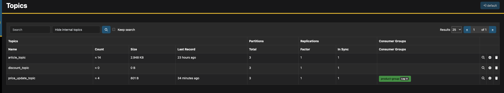
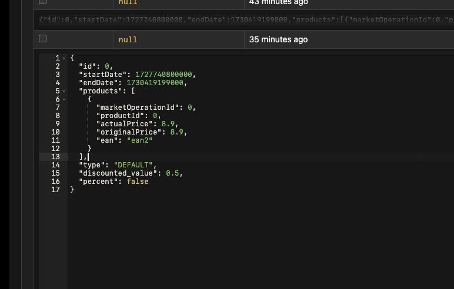

# PROJET SRA1

Groupe B - Projet 3

Axel LABARRE M2GL - <axel.labarre.etu@univ-lille.fr>
Jean Emmanuel EHUY - <jeanemmanuelkarld.ehuy.etu@univ-lille.fr>
Thomas Desruelle - <thomas.desruelle.etu@univ-lille.fr>

## PRE-REQUIS

Avoir démarrer le démon docker sur sa machine

## Configuration de développement en local

Vous veillerez à ouvrir 3 terminaux au préalable pour les taches (1), (2.a) et (2.b)

1. Lancement des conteneurs kafka :

    ```sh
    docker-compose -f docker-compose.local.yml up -d
    ```

2. Lancement des micro-services :

    a. Product-Referencement

    ```sh
    cd product-referencement && mvn clean install
    ```

    puis

    ```sh
    cd productreferencement-application && mvn spring-boot:run
    ```

    b. Discount-Management :

    ```sh
    cd discount-management && mvn clean install
    ```

    puis

    ```sh
    cd discountmanagement-application && mvn spring-boot:run
    ```

## Configuration de pré-production

1. Lancement des conteneurs kafka & micro-services

    ```sh
    docker-compose -f docker-compose.yml up -d
    ```

* URL product-referencement-api : `http://localhost:8082/swagger-ui/index.html`
* URL discount-management-api : `http://localhost:8083/swagger-ui/index.html`
* URL kafka : `http://localhost:3000`

---

## Help - Commandes docker utiles

* Arreter docker :

    ```sh
    docker-compose -f <docker-compose.yml> down
    ```

* Reconstuire les conteneurs dockers si nouveaux changements :

    ```sh
    docker-compose build
    ```

* Lancer un terminal interactif dans un conteneur :

    ```sh
    docker exec -it <contneur> bash
    ```

* Inspecter les logs d'un conteneur :

    ```sh
    docker logs <contneur>
    ```

## Exemple Swagger

### Référencement de produits et stock

[lien du swagger](http://localhost:8082/swagger-ui/index.html#/)

**UserStory : En tant qu'administrateur je peux gérer les produits de ma base article.**  

`GET - /admin/articles/search`:

* sans paramètre : execute sans paramètre donne la liste complète des articles
* exemple de filtre :
  * categories : 'Viande'
  * categories : 'Viande' | subName : 'Prod'

`PUT - /admin/articles/{articleId}`:  

Exemple modification d'un article :  

`articleId` : 1 (du pain).

```json
{
  "name": "Pain au lait",
  "brand": "Chez Boulanger",
  "price": 150,
  "ean": "16348223",
  "vat": 0,
  "img": "pain_au_lait.png",
  "categories": [
    "Pâtisserie"
  ],
  "quantity": 15
}
```

l'Ajout d'un article se fait par son stock.

**En tant qu'administrateur je peux gérer les stocks de mes produits afin de ne présenter que les produits en stock.**

`POST - /admin/article/add`:  

Exemple :  Ajout d'un stock de 20 viandes.

```json
{
  "name": "Boeuf",
  "brand": "protein",
  "price": 15,
  "ean": "123456",
  "vat": 0,
  "img": "boeuf.png",
  "categories": [
    "Viande"
  ],
  "quantity": 20
}
```

**En tant qu'administrateur je peux enregistrer un arrivage de denrées périssables.**

`POST - /admin/perishables/stock`:  

Exemple : Ajout d'un stock de 15 yaourts.

```json
{
  "ean": "4567890123456",
  "bestBefore": "2024-10-25T19:12:35.859Z",
  "lot": "Premier Lot",
  "quantity": 15
}
```

**En tant qu'administrateur je peux obtenir les produits dont la DLC (date limite de consommation) est dépassée.**

`GET - /admin/article/perishable/expired`: (Juste la route à exécute)

NB : nous n'avons pas eu le temps d'implémenter les deux dernières user stories mais elles sont similaire à la dernière.

# DISCOUNT-MANAGEMENT

Exemple des différents json pour les requestBody.

**NB** : Chaque code doit être écrit en uppercase. La route n'est pas sensible à la casse.
Et la gestion de liste d'ean n'est pas encore totalement implémenté. Le renvoi d'id depuis le microservice stock
n'était pas implémenté.

<http://localhost:8083/swagger-ui-custom.html>

## CODE

```
{
    "eans" : [
        "1234567890123"
    ],
    "startDate" : "2024-04-23T18:25:43.511Z",
    "endDate" : "2025-04-23T18:25:43.511Z",
    "value" : 0.5,
    "isPercent" : false,
    "code" : "PROMO25"
}
```

## DEFAULT

```
{
    "eans" : [
        "1234567890123"
    ],
    "startDate" : "2024-04-23T18:25:43.511Z",
    "endDate" : "2025-04-23T18:25:43.511Z",
    "value" : 0.6,
    "isPercent" : false
}
```

## LOT

```
{
    "eans" : [
        "1234567890123"
    ],
    "startDate" : "2024-04-23T18:25:43.511Z",
    "endDate" : "2025-04-23T18:25:43.511Z",
    "numberForLot" : 3,
    "priceForLot" : 3.0
}
```

## LEAST_PRICEY

```
{
    "eans" : [
        "1234567890123"
    ],
    "startDate" : "2024-04-23T18:25:43.511Z",
    "endDate" : "2025-04-23T18:25:43.511Z",
    "value" : 20.0,
    "isPercent" : true
}
```

## ONE_FREE

```
{
    "eans" : [
        "1234567890123"
    ],
    "startDate" : "2024-04-23T18:25:43.511Z",
    "endDate" : "2025-04-23T18:25:43.511Z",
    "numberForOneFree" : 3
}
```

## KAFKA

Nous avons implémanté Kafka avec un Producer( Discount-Management )  et un Consumer ( Product Referencement )

Pour tester l'envoi d'un message dans le topic price_update_topic

la route :   '<http://localhost:8083/market-operation/add/DEFAULT>'

```json
{
    "eans" : [
        "ean2"
    ],
    "startDate": "2024-10-01T00:00:00Z",
    "endDate": "2024-10-31T23:59:59Z",
    "value" : 0.50,
    "isPercent" : true
}
```





Côté Product-Referencement :

```sh
2024-10-25T22:39:02.223+02:00  INFO 38547 --- [ntainer#0-0-C-1] o.a.k.c.c.internals.ConsumerCoordinator  : [Consumer clientId=consumer-product-group-1, groupId=product-group] Finished assignment for group at generation 3: {consumer-product-group-1-6ce7eb3b-d024-4a68-9ee4-632c075ce3f5=Assignment(partitions=[price_update_topic-0, price_update_topic-1, price_update_topic-2])}
```
